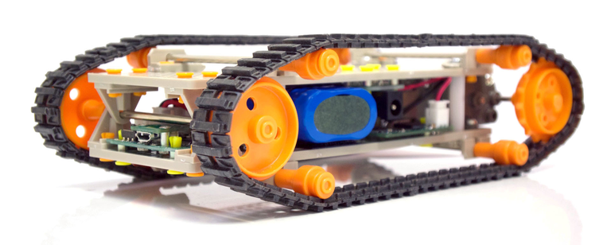

# CrawlLibrary 

[Omniment, Inc.](http://omniment.co.jp/) の教育向けロボットキット [Crawl](http://omniment.co.jp/crawl/) の Arduino ライブラリです。

ライブラリのインストール方法はスタートガイド、または各種資料を参照してください。

## Download

- 最新版: https://github.com/Omniment/CrawlLibrary/archive/master.zip
- 過去のリリース: https://github.com/Omniment/CrawlLibrary/releases

## API documentation

- 最新版: https://omniment.github.io/CrawlLibrary/latest/
